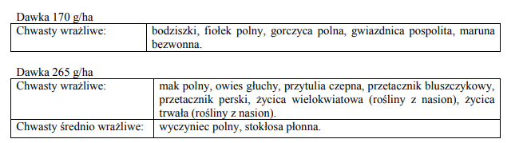

# Azure AI Document Intelligence
Stosunkowo nowe rozwiązanie Microsoftu, zbierające bardzo dobre opinie dotyczące skuteczności.

Rozwiązanie posiada następujące zalety:
- Cloud base
- Łatwa implementacja - kod w pliku azure_di.py wymaga domeny i klucza do zasobu + jednej libki:
```
pip install azure-ai-documentintelligence==1.0.0b2
```
- free tier 500 stron/miesiąc (wymagane jest konto Azure z podpiętą kartą) - jest to na tyle dużo, że dla odpowiednio małych projektów, może się okazać wystarczająco; pózniej 1,5$/1000 dokumentów

Dzięki dostępności free tier byłem wstanie przetestować rozwiązanie na przykładowym pliku: corello.pdf, wynik można zobaczyć w Corello_azure.md

Ciekawym przykładem jest fragment pdf, w którym przy pomocy 2 tabel opisywane są dawki: 


**Większość darmowych rozwiązań słabo sobie z tym radziło, np zlewając nagłowek z tabelą, azure AI zdaje sobie radzić nieco lepiej (choć wciąż nieidealnie, ignorując strukturę tabeli jednowierszowej):**


UWAGA: API działa tylko dla zasobów w konkretnych lokalizacjach. Dla Europy dostępna jest tylko lokalizacja WEST EU. Należy uważać, ponieważ zwracany błąd nie dostarcza przydatnych informacji.
